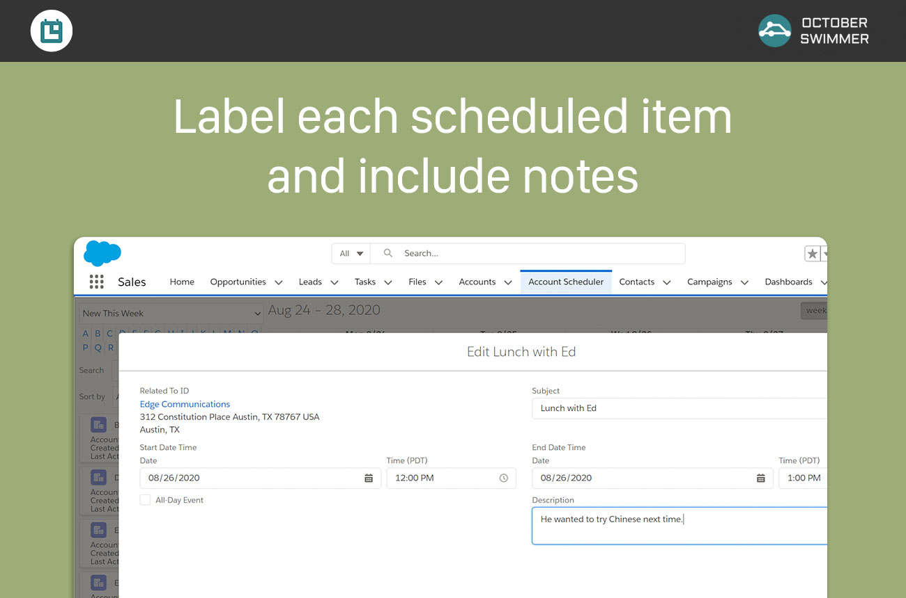

# Lunasa
## Drag-and-Drop Account Appointment Scheduler for Salesforce

Schedule events for any account all on one screen. Drag and drop scheduler lets
you plan your day, week, and month, all on one page. Manage your calendar and
make appointments quickly and easily with Lunasa.

## Installation

[Install Lunasa managed package in production org](https://installer.octoberswimmer.com/?namespace=oscal&version=1.22&id=033f4000000IjDwAAK)

[Install Lunasa managed package in sandbox](https://installer.octoberswimmer.com/?namespace=oscal&version=1.22&id=033f4000000IjDwAAK&endpoint=https://test.salesforce.com)

## Configuration

Review the [brief configuration guide](docs/Lunasa-Drag-and-Drop-Calendar.pdf)
for customization options.

# License

* Free to use in sandboxes and developer orgs
* [Sponsor](https://github.com/sponsors/octoberswimmer) development at the $150/month or $3,000 one-time level for production use.  Includes unlimited users.
